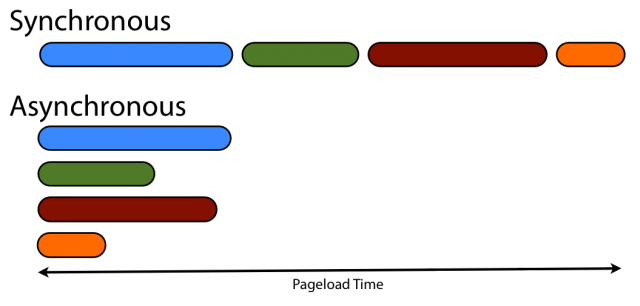

# 简述JS异步函数
---- 

**先来说说JS的运行机制**

-单线程

**那么问题来了**

-单线程如何处理网络请求、文件读写等耗时操作？一个一个等待？那岂不是要等到猴年马月？

**有解决方案吗？**

-有！JavaScript 异步机制。

**先来说说同步、异步**



依据微软的 MSDN 上的解说

-同步

`当一个函数是同步执行时，那么当该函数被调用时不会立即返回，直到该函数所要做的事情全都做完了才返回。`

如：
```js
(function () {
	const a = 1;
	const b = 2;
	const c = a + b;
	console.log("c",c);
	console.log('打印出来')//只有当上面的都运行完之后，最后才会打印出这段
}())
```

-异步

`如果一个异步函数被调用时，该函数会立即返回尽管该函数规定的操作任务还没有完成。`

如：
```js
function async() {
	return console.log("2秒后才会打印")
}

setTimeout("async()",2000)
```

JS的异步处理，大多都是利用回调函数。基本类似于：
```js
function getAsync(callback) {
	setTimeout(function () {
　　　　// todo...
　　　　callback();
　　}, 1000);
};
```

但这也只是一种。其他类型还有事件监听、发布/订阅等。每个人都可以定义一套自己的规则和规范，并且异步代码大都层层嵌套，不好理解。而异步处理是 JS 里很常用的处理机制。为了规范化，ES6 里新增了 Promise 对象。

**Promise**

-Promise 是抽象异步处理对象以及对其进行各种操作的组件。

-`（文案版,引自网友）`Promise 是一个美好的承诺，承诺本身会做出正确延时或异步操作。承诺会解决 callback 处理异步回调可能产生的调用过早，调用过晚、调用次数过多过少、吞掉可能出现的错误或异常问题等。另外承诺只接受**_首次_** resolve(..) 或 reject(..) 决议，承诺本身状态转变后不会再变，承诺所有通过 then(..) 注册的回调总是依次异步调用，承诺所有异常总会被捕获抛出。她，是一个可信任的承诺。

Promise中有几个状态：
- pending: 初始状态, 非 fulfilled 或 rejected；
- fulfilled: 成功的操作，为表述方便，fulfilled 使用 resolved 代替；
- rejected: 失败的操作。


在 ES6 Promises 标准中定义的API还不是很多，目前大致有下面三种类型：
> Constructor
> > Promise 类似于 `XMLHttpRequest`，从构造函数 `Promise` 来创建一个新建新 `promise` 对象作为接口。
> > 要想创建一个 `promise` 对象、可以使用 `new` 来调用 `Promise` 的构造器来进行实例化。

> > ```js
> > var promise = new Promise(function(resolve, reject) {
> >     // 异步处理
> > 	if (/* 异步操作成功 */){
> > 	// 处理结束后，成功调用resolve 
> >     	resolve(value);
> >   	} else {
> > 	//失败调用reject
> >     	reject(error);
> >   	}
> > });
> > ```

> Instance Method
> > 对通过 `new` 生成的 `promise` 对象为了设置其值在 `resolve` (成功) /  `reject` (失败)时调用的回调函数可以使用 `promise.then()`  实例方法。一个 `promise` 可以调用多个 `then` 方法，每次返回新的 `promise` 的对象。

> > ```js
> > promise.then(function(value) {
> >   // success时的处理
> > }, function(error) {
> >   // failure时的处理
> > });
> > ```

> > 当失败时，也可以用`promise.catch(function(error){})` 获取错误并处理错误。
> > 在 ES9 里引入了一个新方法`promise.finally(function(){})` 。该方法用于不管 `Promise` 对象最后状态如何，都会执行此操作。

> Static Method
> > 像 `Promise` 这样的全局对象还拥有一些静态方法。
> > 包括 ` Promise.all() `[^1] 还有  `Promise.race()`[^2] 等在内，主要都是一些对 `Promise` 进行操作的辅助方法。

**Promise**
```js
//此函数传入两个参数：时间，promise 函数
//此函数作用判断调用的 promise 函数是否超时。
//因为 promise 只会返回首次状态，一旦状态确定后，之后便不会再变。
const timeOut = (ms, promise) => {
  return new Promise((resolve, reject) => {
    const timeoutId = setTimeout(() => {
      reject(new Error("超时啦~~"))
    }, ms)
    promise.then(
      res => {
        clearTimeout(timeoutId)
        resolve(res)
      },
      err => {
        clearTimeout(timeoutId)
        reject(err)
      }
    )
  })
}

//这是一个0s之后返回的 promise 函数
const onTime = () => new Promise((resolve) => {
	setTimeout(() => {
		resolve("0s完成了")
	},0)
})

//这是一个2s之后返回的 promise 函数
const outTime = () => new Promise((resolve) => {
	setTimeout(() => {
		resolve("2000s完成了")
	},2000)
})

const testOnTime = () => {
	//这里调用了 timeOut 函数，并设置超时时间为1s，传入 onTime 函数
	return timeOut(1000,onTime())
		.then(res => {
			console.log("res",res)
		})
		.catch(err => {
			console.log("err",err)
		})
}

//运行
testOnTime()
//打印结果为:res 0s完成了
//因为超时时间为1s,而 onTime 则在0s之后即返回，所以没有超时。

const testOutTime = () => {
	//这里调用了 timeOut 函数，并设置超时时间为1s，传入 outTime 函数
	return timeOut(1000,outTime())
		.then(res => {
			console.log("res",res)
		})
		.catch(err => {
			console.log("err",err)
		})
}

//运行
testOutTime()
//打印结果为:err Error: 超时啦~~
//因为超时时间为1s,而 onTime 则在2s之后即返回，不能在1s内返回，所以超时。

//利用Promise.race()改写 testOnTime 和 testOutTime 方法
const timeOutRace = (ms) => {
    return new Promise((resolve, reject) => {
      const timeoutId = setTimeout(() => {
        reject(new Error("超时啦~~"))
      }, ms)
    })
}

const testOnTimeRace = () => {
	const p1 = timeOutRace(1000);
	const p2 = onTime();
	Promise.race([p1,p2]).then(result => {
		console.log("result",result)
	}).catch(error => {
		console.log("error",error)
	})
}

const testOutTimeRace = () => {
	const p1 = timeOutRace(1000);
	const p2 = outTime();
	Promise.race([p1,p2]).then(result => {
		console.log("result",result)
	}).catch(error => {
		console.log("error",error)
	})
}

//Promise.all()
const showAll1 = () => {
	const p1 = onTime();
	const p2 = outTime();
	Promise.all([p1,p2]).then(res => {
		console.log("res",res)
	}).catch(err => {
		console.log("err",err)
	})
}

const showAll2 = () => {
	const p1 = onTime();
	const p2 = outTime();
	const p3 = timeOutRace(1000);
	Promise.all([p1,p2,p3]).then(res => {
		console.log("res",res)
	}).catch(err => {
		console.log("err",err)
	})
}
```

** Async/Await**

ES8 标准引入了 async 函数，使得异步处理变得更加方便，类似同步的写法。单个人感觉在理解上并不如 Promise 。
async 函数返回一个 Promise 对象，可以使用 then 方法添加回调函数。当函数执行的时候，一旦遇到 await 就会先返回，等到异步操作完成，再接着执行函数体内后面的语句。

```js
const testAsyncOnTime = async () => {
	try {
		const res = await timeOut(1000,onTime())
		console.log("res",res)
	}catch(err){
		console.log("err",err)
	}
}

const testAsyncOutTime = async () => {
	try {
		const res = await timeOut(1000,outTime())
		console.log("res",res)
	}catch(err){
		console.log("err",err)
	}
}
```

[^1]:	Promise.all 方法用于将多个 Promise 实例，包装成一个新的 Promise 实例。
	成功时，返回的是一个数组。
	失败时，返回的是最先被 reject 的状态值。

[^2]:	Promise.race 方法返回最先得到的结果，无论成功还是失败。

